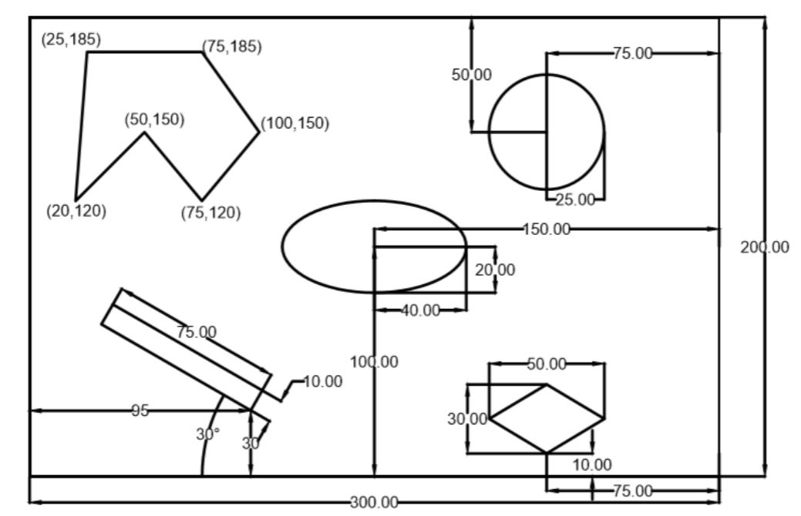

# Implementation-of-Dijkstra-algorithm
### Description
Implementation of Dijkstra algorithm is tested on a obstacle space for both rigid and point robot. The robot will maneuver through the obstacle space to reach the goal point with minimum cost. For rigid robot, the dimension of the robot is also considered and world space is converted into configuration space by increasing the scale of the obstacles and converting the rigid robot into point robot.

### Obstacle space

### Actions
There are eight acions carried out to make the robot reach the goal point:
1. Move Right
2. Move Left
3. Move Up
4. Move Down
5. Move Up Left
6. Move Up Right
7. Move Down Left
8. Move Down Right


### Dependencies 
python -version 3   

### Library
Numpy

### Run Code
Enter the following to run the dijkstra for point robot.

```
cd [to 'codes' directory]
python3 Dijkstra_point.py
```
Enter the following to run the dijkstra for rigid robot.

```
cd [to 'codes' directory]
python3 Dijkstra_rigid.py
```

### Input Instruction:
As soon as you run the program, the following prompt occurs in the command window:
```
Enter the Radius of the Rigid body:

Enter the Clearance required for the Rigid body:

Enter the value of Start Node X co-ordinate:

Enter the value of Start Node Y co-ordinate:

Enter the value of Goal Node X co-ordinate:
```
For point robot enter radius and clearance as 0.
For all these prompt please enter integers between 0 and 299 for X-coordinate and 0 and 199 for Y-coordinate.
Please enter the elements of the matrix row wise typing enter


### Sample output for rigid robot:
After running the python file
```
Enter the Radius of the Rigid body:2
Enter the Clearance required for the Rigid body:5

Enter the value of Start Node X co-ordinate:5

Enter the value of Start Node Y co-ordinate:5

Enter the value of Goal Node X co-ordinate:195

Enter the value of Goal Node Y co-ordinate:295
Entered input is out of bounds. Please enter a valid input!!

Enter the value of Goal Node X co-ordinate:295

Enter the value of Goal Node Y co-ordinate:195
Exploring nodes...
```
```
Cost took to reach the goal is: 395.64675298172733
Backtracking...
Total time taken 128.9800910949707
```
For worst case time taken for rigid robot is 128.9800910949707 seconds.

### Sample output for point robot:
After running the python file
```
Enter the value of Start Node X co-ordinate:5

Enter the value of Start Node Y co-ordinate:5

Enter the value of Goal Node X co-ordinate:295

Enter the value of Goal Node Y co-ordinate:195
Exploring nodes...
```
```
Cost took to reach the goal is: 375.1442276647859
Backtracking...
Total time taken 696.1416163444519 seconds
```

### Note
For small distances, after finding the goal point the pygame will immediately start the simulation and reach the goal point. The goal exploration is not clearly see for small distances. For large distances it is clearly seen.

### Obstacle assumption:
In obstacle space, for rectangle obstacle which is faced at an angle of 30 degrees, we were getting decimal points as coordinates. So we round that to integer as pixel values cannot be decimals. As a result, when you give 10 or greater than 10 as clearance, the shape of the rectangle may differ.